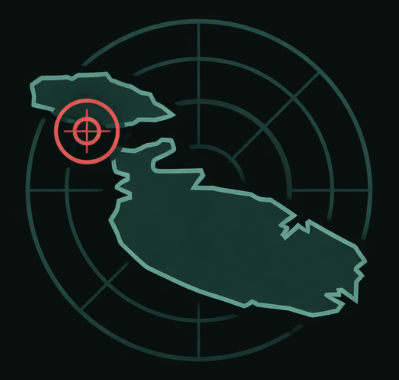
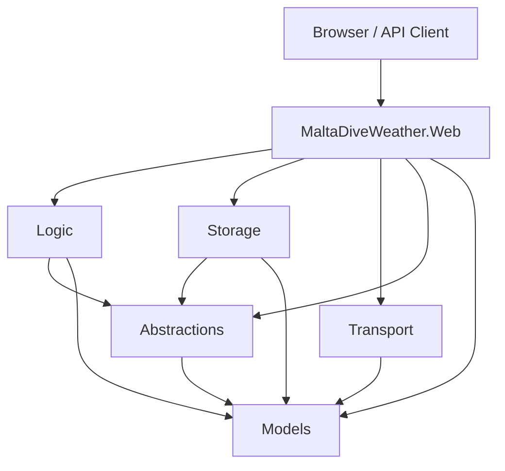
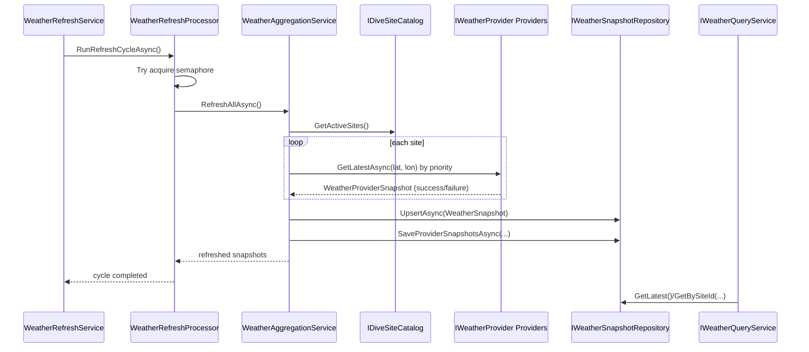
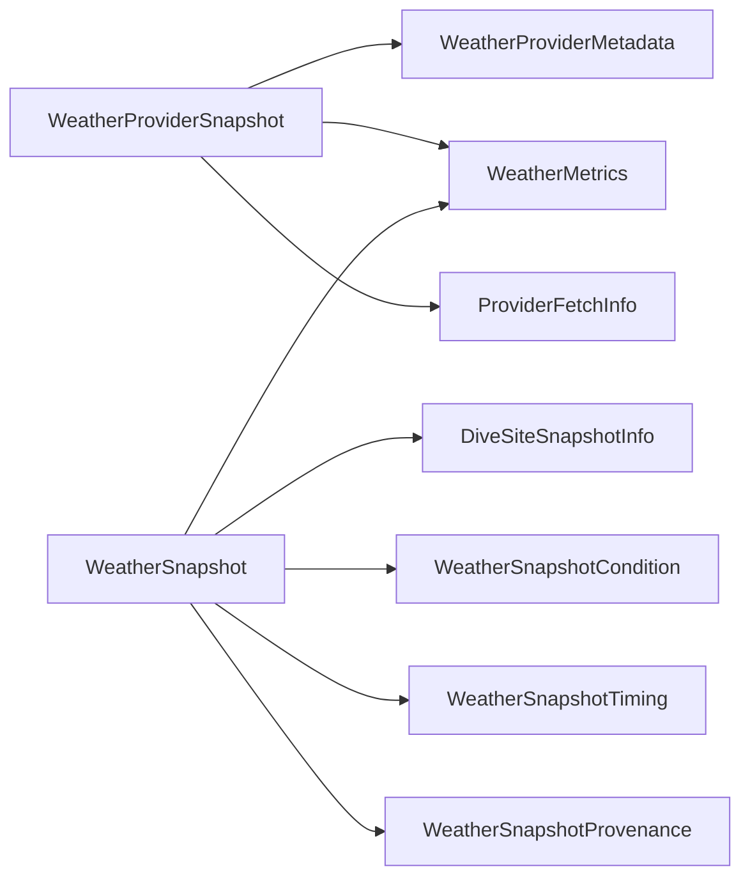

# MaltaDiveRadar



MaltaDiveRadar is a .NET 10 ASP.NET Core web application that aggregates
weather and marine conditions for Malta dive sites and serves them through a
Minimal API + static frontend.

The app refreshes data in the background, stores snapshots in memory, and
renders a tactical SVG map UI.

## 1. Stack and Runtime

- Backend: ASP.NET Core Minimal API (`net10.0`)
- Frontend: static `wwwroot` (`index.html`, vanilla JS modules, CSS)
- Logging: Serilog console sink
- Storage: in-memory (`ConcurrentDictionary` + `IMemoryCache`)
- Scheduling: `BackgroundService` + `PeriodicTimer`
- Resilience: provider retries + timeout + stale snapshot behavior

## 2. Solution Structure

Solution file: `src/MaltaDiveWeather.slnx`

Projects:

- `src/Abstractions`
  - Service/repository contracts (`IWeatherProvider`, `IWeatherQueryService`,
    `IWeatherAggregationService`, `IWeatherRefreshProcessor`, etc.).
- `src/Models`
  - Rich domain/value types with validation (`DiveSiteName`, `IslandName`,
    `Latitude`, `WaveHeight`, `WindSpeed`, `ProviderName`, `ProviderPriority`,
    `QualityScore`, etc.).
  - Composed snapshots (`WeatherProviderSnapshot`, `WeatherSnapshot`).
- `src/Logic`
  - Use-case orchestration:
  - `WeatherRefreshProcessor` (single refresh cycle)
  - `WeatherAggregationService` (cross-provider aggregation)
  - `WeatherQueryService` (read model service)
  - `SeaConditionClassifier` (domain classification logic)
- `src/Storage`
  - Provider implementations (`OpenMeteo`, `WeatherAPI`, `OpenWeather`,
    `DemoWeatherProvider`)
  - In-memory repositories/catalog
  - Config option objects for providers and dive sites
- `src/Transport`
  - API DTOs + mapping (`ApiDtoMapper`)
- `src/MaltaDiveWeather.Web`
  - Host/composition root (`Program`, `StartupHelpers`,
    `ServiceCollectionExtensions`)
  - Background hosted service (`WeatherRefreshService`)
  - API endpoints and static files

## 3. Architecture Diagram



## 4. How It Works (End-to-End)

1. Web host starts and configures DI/options.
2. `WeatherRefreshService` (background service) waits startup delay.
3. It triggers `IWeatherRefreshProcessor.RunRefreshCycleAsync(...)`.
4. `WeatherRefreshProcessor` uses a semaphore to prevent overlapping refreshes.
5. `WeatherAggregationService` refreshes each active site:
   - calls providers by priority,
   - captures provider snapshots,
   - aggregates best metric sources,
   - classifies sea conditions,
   - stores final snapshot in repository.
6. API endpoints read from `IWeatherQueryService`.
7. Frontend polls `/api/weather/latest` and renders site + provider diagnostics.

### Refresh Sequence



## 5. Domain Model Composition

Both snapshot models are composition-based to reduce constructor complexity.



## 6. Provider and Aggregation Rules

- Providers implement `IWeatherProvider`.
- `WeatherProviderBase` provides:
  - enable/disable gate from config,
  - HTTP retry logic (`MAX_RETRY_ATTEMPTS = 3`),
  - normalization to domain value objects,
  - success/failure snapshot creation.
- Aggregation selection logic:
  - choose provider candidates that have a metric,
  - optionally prefer `SupportsMarineData` for marine metrics,
  - then rank by newest `ObservationTimeUtc`,
  - then by highest `QualityScore`,
  - then by lowest `Priority` value.

Sea-condition classifier (`SeaConditionClassifier`) uses domain thresholds:

- Rough: high waves or strong wind
- Caution: moderate waves or moderate wind
- Good/Unknown: based on available metrics

## 7. Snapshot and Stale Behavior

If all providers fail for a site:

- existing snapshot is marked stale (`MarkStaleAsync`)
- if no previous snapshot exists, an unavailable snapshot is created
- provider diagnostics are still saved

This keeps the UI/API available even during provider outages.

## 8. API Endpoints

All API routes are under `/api`.

- `GET /api/sites`
  - Returns all configured dive sites.
- `GET /api/sites/{id:int}`
  - Returns one site by ID.
- `GET /api/sites/{id:int}/weather`
  - Returns latest weather snapshot for that site.
- `GET /api/weather/latest`
  - Returns dashboard payload (`lastRefreshUtc` + site snapshots).
- `GET /api/health/providers`
  - Returns aggregated provider health stats (success rate, last error, etc.).

Error payload shape:

```json
{ "error": "message" }
```

## 9. Configuration

Main file: `src/MaltaDiveWeather.Web/appsettings.json`

### `WeatherRefresh`

- `DemoMode` (`bool`)
- `RefreshIntervalMinutes` (`1..720`)
- `StartupDelaySeconds` (`0..300`)
- `HttpTimeoutSeconds` (`5..120`)
- `Providers.OpenMeteo` (`Enabled`, `Priority`)
- `Providers.WeatherApi` (`Enabled`, `Priority`, `ApiKey`)
- `Providers.OpenWeather` (`Enabled`, `Priority`, `ApiKey`)

Validation on startup:

- at least one provider enabled OR demo mode enabled
- enabled provider priorities must be unique
- enabled providers that need API keys must have keys

### `DiveSites`

- `DiveSites.Sites[]` entries loaded via `IOptions<DiveSiteCatalogOptions>`
- each item:
  - `Id`, `Name`, `Island`, `Latitude`, `Longitude`, `DisplayX`, `DisplayY`,
    `IsActive`

Validation on startup:

- at least one site configured
- site IDs unique
- site names unique (case-insensitive)
- site names/islands non-empty
- data annotation ranges for numeric fields
- domain validation when mapped (for example island normalization/allowed values)

## 10. Caching and In-Memory Storage

`InMemoryWeatherSnapshotRepository` stores:

- latest per-site snapshot (`ConcurrentDictionary`)
- per-site provider snapshots (`ConcurrentDictionary`)

`IMemoryCache` keys:

- site snapshot cache: 10 minutes
- provider snapshot cache: 10 minutes
- latest snapshot list cache: 2 minutes

## 11. DTO Boundary Rule

Domain/Logic layers work with domain models.

- API input/output uses Transport DTOs.
- Mapping between domain and DTO is centralized in `Transport/ApiDtoMapper.cs`.

## 12. Running Locally

```powershell
dotnet restore src/MaltaDiveWeather.slnx
dotnet build src/MaltaDiveWeather.slnx -c Release
dotnet run --project src/MaltaDiveWeather.Web/MaltaDiveWeather.Web.csproj
```

Open the URL printed in console (typically `https://localhost:5001`).

Recommended quality commands:

```powershell
dotnet restore src/MaltaDiveWeather.slnx
dotnet build src/MaltaDiveWeather.slnx -c Release
dotnet test src/MaltaDiveWeather.slnx -c Release
```

## 13. Frontend

Static frontend files:

- `wwwroot/index.html`
- `wwwroot/js/main.js`
- `wwwroot/js/shared.js`
- `wwwroot/css/site.css`
- `wwwroot/assets/malta-gozo-map.svg`

The UI reads API data and renders:

- tactical map markers for configured dive sites
- per-site metric panel
- provider diagnostics list

## 14. Security Notes

- Do not keep real production API keys in repository config.
- Prefer environment variables or secret stores, for example:
  - `WeatherRefresh__Providers__WeatherApi__ApiKey`
  - `WeatherRefresh__Providers__OpenWeather__ApiKey`

